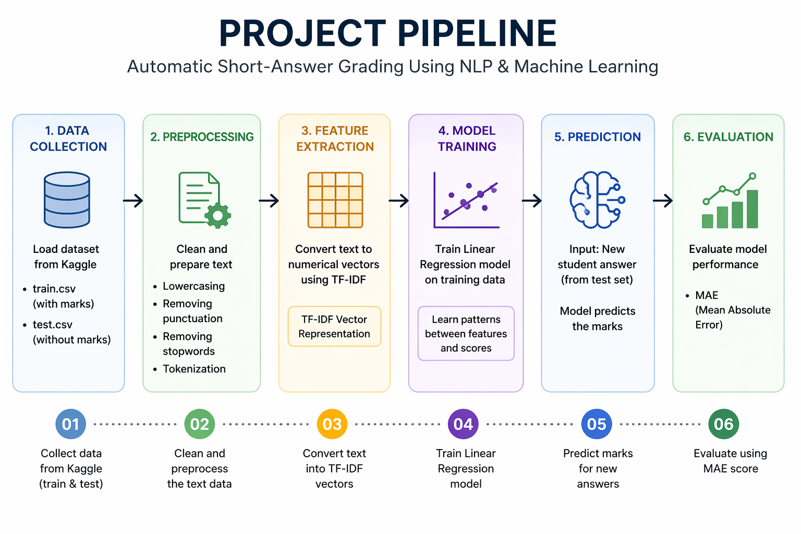
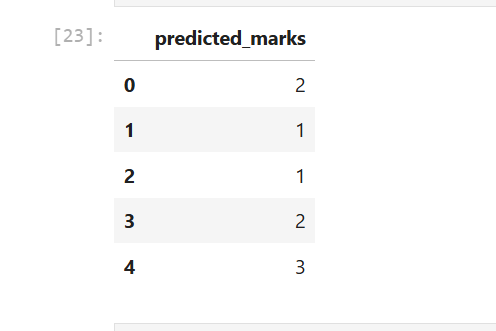

# 📚 Automatic Short-Answer Grading Using NLP & Machine Learning

## 📌 Overview

This project implements an **Automatic Short-Answer Grading System** using **Natural Language Processing (NLP)** and **Machine Learning**.

The system predicts marks for student short answers by comparing them with the corresponding reference answers using **TF-IDF Vectorization** and **Linear Regression**.

---

## 🚀 Features

- Text preprocessing using NLTK
- Stopword removal
- TF-IDF Vectorization
- Automatic score prediction
- Linear Regression model
- Model evaluation using Mean Absolute Error (MAE)

---

## 🛠 Technologies Used

- Python
- Pandas
- NumPy
- NLTK
- Scikit-learn
- Matplotlib
- Jupyter Notebook

---

## 📂 Dataset

Dataset Source:
Kaggle – Automatic Short Answer Grading Dataset

Dataset contains:

- Questions
- Model Answers
- Student Answers
- Teacher Marks

Files used:

- train.csv
- test.csv

---

## ⚙️ Project Workflow

```
Dataset
      ↓
Text Preprocessing
      ↓
TF-IDF Vectorization
      ↓
Linear Regression Model
      ↓
Score Prediction
      ↓
Performance Evaluation (MAE)


## 📊 Model Performance

Evaluation Metric:

**Mean Absolute Error (MAE)**

```
MAE = 1.44
```

This means the model's predicted score differs from the teacher's score by approximately **1.44 marks** on average.

---

## 📷 Project Pipeline



---

## 📈 Model Output

### Actual vs Predicted Scores


### Sample Output



---

## 🔮 Future Improvements

- Use BERT for semantic understanding
- Sentence-BERT embeddings
- Deep Learning based grading
- Better semantic similarity models

---

## 👨‍💻 Author

**Omkar Kumbhar**
